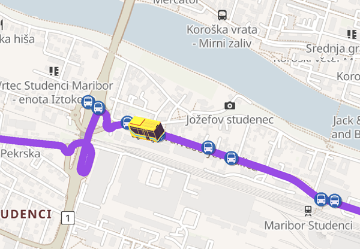
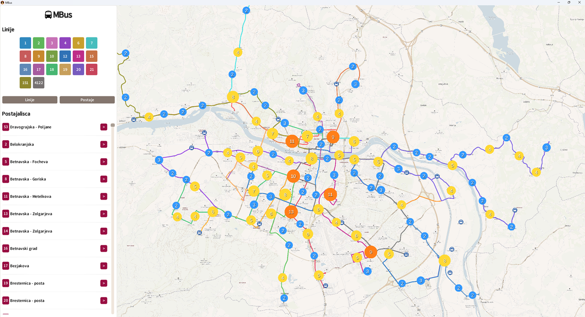
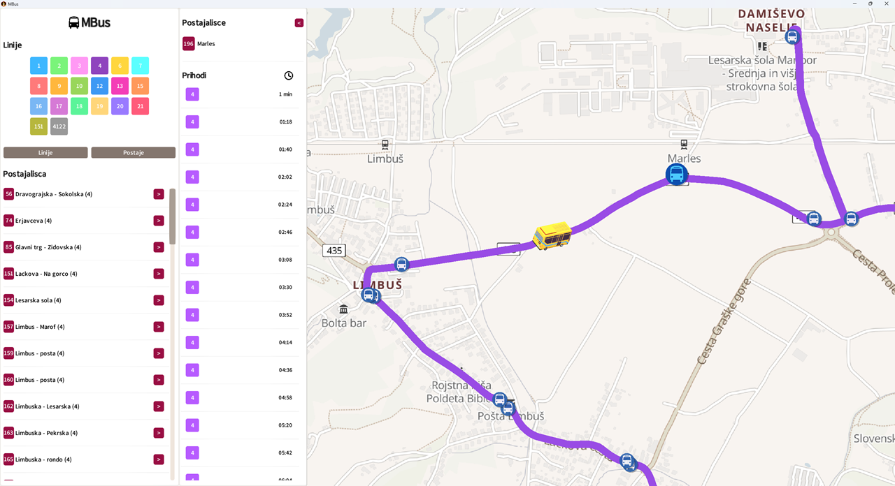

# MBus — Maribor Bus Tracker


A desktop bus tracking application for the city of Maribor, Slovenia, built with **Java** and **LibGDX**. MBus visualizes local bus lines and stops on an interactive map, with animated real-time bus position simulation based on schedule data.



---

## Download

| File                     | Description |
|--------------------------|-------------|
| `mbus-vX.X.X-winX64.zip` | Windows 64-bit — no Java required, just extract and run the .exe |
| `mbus-vX.X.X.jar`        | Cross-platform — requires Java 17+ |

See the [Releases](../../releases) page to download the latest version.

---

## Features

- **Interactive map** rendered from raster tiles (Geoapify / OpenStreetMap), with tile caching for offline use
- **Bus line visualization** with per-line color coding, hover effects, and animated selection
- **Bus stop markers** with dynamic clustering that adapts to zoom level
- **Animated bus positions** calculated from schedule data and rendered directionally (8-direction sprites)
- **HUD panel** for filtering lines and stops, with a searchable list and per-stop detail view
- **Smooth camera** with gesture-based pan/zoom, clamped to the map bounds, and animated fly-to on stop selection
- **Background loading screen** with threaded tile downloads and data parsing, showing live progress
- **Offline-first design** — ships with a pre-built tile cache; API key is optional and loaded gracefully via reflection if absent

---

## Screenshots




---

## Tech Stack

| Layer | Technology |
|---|---|
| Language | Java 17 |
| Framework | LibGDX |
| Rendering | OrthographicCamera, SpriteBatch, ShapeRenderer, TiledMap |
| Map tiles | Geoapify REST API (OSM Bright) |
| Map data | GeoJSON (bus stops and lines from public Maribor transit data) |
| UI | Scene2D (Stage, Table, Skin) |
| Build | Gradle (Desktop target via LWJGL3 + Construo) |

---

## Architecture

```
MBusTracker (Game)
├── LoadingScreen          — Threaded tile download + GeoJSON parsing
│   ├── MapRasterTiles     — Tile fetch, cache read/write, coordinate math
│   ├── GeoJSONLoader      — Parses bus stop and line geometry
│   └── ScheduleLoader     — Loads or generates bus schedules
└── RasterMapScreen        — Main application screen
    ├── MapRenderer        — Tile map, bus lines, stop markers, labels
    ├── BusAnimationRenderer — Interpolated bus position rendering
    ├── MarkerClusterer    — Zoom-aware stop clustering with animations
    ├── HudPanel           — Line/stop filter sidebar
    ├── BusStopDetailPanel — Per-stop schedule detail view
    └── Input
        ├── MapGestureListener  — Pan, zoom, tap handling
        ├── MarkerClickHandler  — Stop hit testing in world space
        └── BusLineClickHandler — Line segment hit testing
```

---

## Getting Started (Developers)

### Prerequisites

- Java 17+
- Gradle (wrapper included)

### Clone the repository

```bash
git clone https://github.com/OAndrija/mbus-tracker.git
cd mbus-tracker
```

### Run from source

```bash
./gradlew lwjgl3:run
```

### Build a distributable JAR

```bash
./gradlew lwjgl3:jar
```

Output: `lwjgl3/build/libs/`

### Build a Windows executable

```bash
./gradlew lwjgl3:packageWinX64
```

Output: `lwjgl3/build/construo/`

The JAR and EXE both include all assets and the pre-cached map tiles, so no network connection or API key is required for normal use.

### API Key (optional)

If you want the app to re-download tiles on cache miss, create `core/src/main/java/com/mbus/app/utils/Keys.java`:

```java
public class Keys {
    public static final String GEOAPIFY = "your_key_here";
}
```

If this file is absent the app runs in cache-only mode — no errors, no crashes.

---

## License

This project is licensed under the MIT License — see the [LICENSE](LICENSE) file for details.
